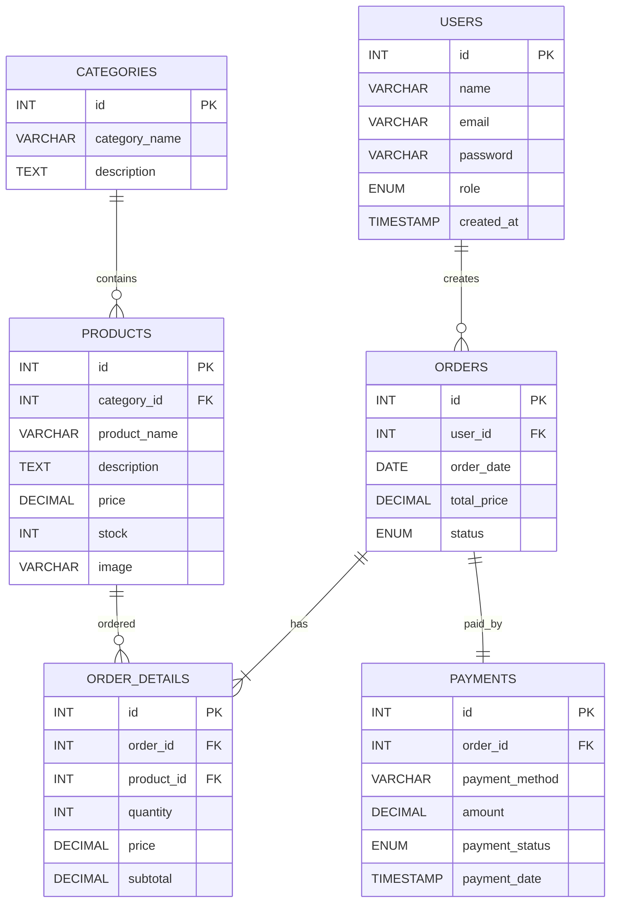

# Database Schema Documentation

## AVOLICIUS

### Sistem Informasi Manajemen Pemesanan Produk Berbasis Alpukat

---

# Informasi Database

| Keterangan    | Isi                 |
| ------------- | ------------------- |
| Database      | avolicius_db        |
| DBMS          | MySQL               |
| Engine        | InnoDB              |
| Character Set | utf8mb4             |
| Storage       | Relational Database |

---

# Deskripsi

Database AVOLICIUS dirancang menggunakan model Relational Database Management System (RDBMS) dengan MySQL sebagai sistem manajemen basis data.

Struktur database dibuat untuk mendukung proses pemesanan produk berbahan dasar alpukat, mulai dari pengelolaan produk, pelanggan, pesanan, transaksi pembayaran, hingga laporan penjualan.

---

# Entity Relationship Diagram (ERD)

---

# Struktur Tabel

## 1. users

Digunakan untuk menyimpan data pengguna sistem, baik Administrator maupun Customer.

| Field      | Type                     | Keterangan             |
| ---------- | ------------------------ | ---------------------- |
| id         | INT                      | Primary Key            |
| name       | VARCHAR(100)             | Nama pengguna          |
| email      | VARCHAR(100)             | Email                  |
| password   | VARCHAR(255)             | Password terenkripsi   |
| role       | ENUM('admin','customer') | Hak akses              |
| created_at | TIMESTAMP                | Tanggal pembuatan akun |

---

## 2. categories

Digunakan untuk mengelompokkan produk.

| Field         | Type         | Keterangan         |
| ------------- | ------------ | ------------------ |
| id            | INT          | Primary Key        |
| category_name | VARCHAR(100) | Nama kategori      |
| description   | TEXT         | Deskripsi kategori |

---

## 3. products

Menyimpan seluruh data produk AVOLICIUS.

| Field        | Type          | Keterangan       |
| ------------ | ------------- | ---------------- |
| id           | INT           | Primary Key      |
| category_id  | INT           | Foreign Key      |
| product_name | VARCHAR(150)  | Nama produk      |
| description  | TEXT          | Deskripsi produk |
| price        | DECIMAL(10,2) | Harga            |
| stock        | INT           | Stok produk      |
| image        | VARCHAR(255)  | Gambar produk    |

---

## 4. orders

Menyimpan data transaksi pemesanan pelanggan.

| Field       | Type                                              | Keterangan        |
| ----------- | ------------------------------------------------- | ----------------- |
| id          | INT                                               | Primary Key       |
| user_id     | INT                                               | Foreign Key       |
| order_date  | DATE                                              | Tanggal pemesanan |
| total_price | DECIMAL(10,2)                                     | Total pembayaran  |
| status      | ENUM('Pending','Diproses','Selesai','Dibatalkan') | Status pesanan    |

---

## 5. order_details

Menyimpan rincian setiap produk pada suatu pesanan.

| Field      | Type          | Keterangan    |
| ---------- | ------------- | ------------- |
| id         | INT           | Primary Key   |
| order_id   | INT           | Foreign Key   |
| product_id | INT           | Foreign Key   |
| quantity   | INT           | Jumlah produk |
| price      | DECIMAL(10,2) | Harga satuan  |
| subtotal   | DECIMAL(10,2) | Total harga   |

---

## 6. payments

Menyimpan informasi pembayaran pelanggan.

| Field          | Type                            | Keterangan         |
| -------------- | ------------------------------- | ------------------ |
| id             | INT                             | Primary Key        |
| order_id       | INT                             | Foreign Key        |
| payment_method | VARCHAR(50)                     | Metode pembayaran  |
| amount         | DECIMAL(10,2)                   | Nominal pembayaran |
| payment_status | ENUM('Pending','Paid','Failed') | Status pembayaran  |
| payment_date   | TIMESTAMP                       | Waktu pembayaran   |

---

# Relasi Antar Tabel

| Tabel                    | Relasi                                              |
| ------------------------ | --------------------------------------------------- |
| users → orders           | Satu pengguna dapat memiliki banyak pesanan         |
| categories → products    | Satu kategori memiliki banyak produk                |
| products → order_details | Satu produk dapat muncul pada banyak detail pesanan |
| orders → order_details   | Satu pesanan terdiri dari banyak produk             |
| orders → payments        | Satu pesanan memiliki satu data pembayaran          |

---

# Kesesuaian dengan Sprint Planning

Struktur database ini disusun untuk mendukung seluruh fitur yang telah direncanakan pada Sprint 1, antara lain:

* Login Administrator
* Dashboard Admin
* Manajemen Produk
* Manajemen Pesanan
* Manajemen Pelanggan
* Transaksi Pembayaran
* Laporan Penjualan

Dokumen ini menjadi acuan Backend Developer dalam proses implementasi database pada Sprint Development berikutnya.

---

# Kesesuaian dengan GitHub Issues

Database ini mendukung penyelesaian beberapa GitHub Issue yang telah dibuat pada Sprint Planning, antara lain:

* Backend: Setup Database MySQL
* Backend: Membuat API Login Admin
* Backend: CRUD Data Produk
* Backend: Sistem Order Management
* Backend: Integrasi Payment Gateway

---

# Kesimpulan

Database AVOLICIUS dirancang menggunakan pendekatan relasional agar proses pengelolaan data lebih terstruktur, konsisten, dan mudah dikembangkan. Struktur tabel serta relasi yang dirancang pada dokumen ini menjadi blueprint implementasi database selama proses pengembangan aplikasi berlangsung.